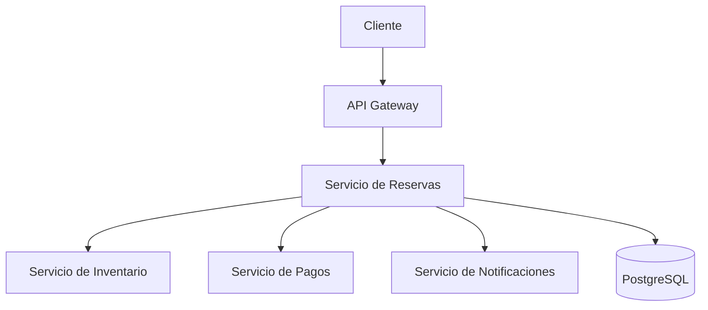

# Sistema de Reservas Resiliente

Sistema distribuido basado en microservicios, desarrollado para demostrar mecanismos de tolerancia a fallos y resiliencia mediante un despliegue sobre Kubernetes.

## Tabla de contenidos

- [Objetivo](#objetivo)
- [Arquitectura](#arquitectura)
- [Tecnologías](#tecnologías)
- [Estructura del proyecto](#estructura-del-proyecto)
- [Requisitos](#requisitos)
- [Construcción de imágenes](#construcción-de-imágenes)
- [Despliegue en Kubernetes](#despliegue-en-kubernetes)
- [Prueba funcional](#prueba-funcional)
- [Escenarios de tolerancia a fallos](#escenarios-de-tolerancia-a-fallos)
- [Evidencias](#evidencias)
- [Resultados](#resultados)
- [Conclusiones](#conclusiones)
- [Autores](#autores)

## Objetivo

Diseñar, implementar y desplegar un sistema de reservas de entradas basado en microservicios, capaz de mantener su disponibilidad ante diferentes escenarios de fallo.

El proyecto aplica mecanismos de resiliencia utilizados en arquitecturas distribuidas modernas y demuestra su funcionamiento mediante pruebas controladas sobre un clúster multinodo de Kubernetes.

## Arquitectura

El sistema está compuesto por los siguientes componentes:

- API Gateway
- Servicio de Reservas
- Servicio de Inventario
- Servicio de Pagos
- Servicio de Notificaciones
- PostgreSQL

### Flujo general



## Tecnologías

| Categoría | Tecnologías |
| --- | --- |
| Backend | Python 3.12, FastAPI, SQLAlchemy |
| Base de datos | PostgreSQL |
| Contenedores | Docker, Docker Compose |
| Orquestación | Kubernetes, kind |
| Pruebas de carga | k6 |
| Automatización | PowerShell |

## Estructura del proyecto

```text
.
├── services/
│   ├── api-gateway/
│   ├── reservas/
│   ├── inventario/
│   ├── pagos/
│   └── notificaciones/
├── kubernetes/
│   ├── base/
│   ├── chaos/
│   └── cluster/
├── scripts/
│   ├── load/
│   ├── demo/
│   └── concurrency/
├── evidence/
└── docker-compose.yml
```

## Requisitos

Antes de ejecutar el proyecto, instala las siguientes herramientas:

- Docker Desktop
- Kubernetes CLI (`kubectl`)
- kind
- Python 3.12
- Git
- k6

## Construcción de imágenes

Construye la imagen de cada microservicio con Docker:

```bash
docker build -t sistema-reservas-resiliente-api-gateway ./services/api-gateway
docker build -t sistema-reservas-resiliente-reservas ./services/reservas
docker build -t sistema-reservas-resiliente-inventario ./services/inventario
docker build -t sistema-reservas-resiliente-pagos ./services/pagos
docker build -t sistema-reservas-resiliente-notificaciones ./services/notificaciones
```

Después, carga las imágenes en el clúster de kind. Por ejemplo:

```bash
kind load docker-image sistema-reservas-resiliente-api-gateway:latest --name reservas-cluster
```

> Repite el comando anterior para cada imagen construida.

## Despliegue en Kubernetes

### 1. Crear el clúster

```bash
kind create cluster --config kubernetes/cluster/kind-config.yaml
```

### 2. Aplicar los recursos

```bash
kubectl apply -k kubernetes/base
```

### 3. Comprobar el estado

```bash
kubectl get nodes
kubectl get deployments -n reservas-app
kubectl get pods -n reservas-app
kubectl get services -n reservas-app
```

## Prueba funcional

Crea una reserva mediante el API Gateway:

```http
POST /reservations
Content-Type: application/json
```

```json
{
  "customer_name": "David Villa",
  "customer_email": "d01072004@gmail.com",
  "event_id": 1,
  "quantity": 1
}
```

## Escenarios de tolerancia a fallos

### 1. Caída de un pod

Se elimina manualmente un pod del Servicio de Reservas para verificar que Kubernetes cree automáticamente una nueva réplica sin afectar la disponibilidad del sistema.

**Mecanismos utilizados:**

- Deployment
- ReplicaSet

### 2. Inventario fantasma

Se simula la caída del Servicio de Inventario. El Servicio de Reservas utiliza un *Circuit Breaker* para evitar llamadas repetidas a un servicio que está fallando.

**Mecanismos utilizados:**

- Circuit Breaker
- Reintentos
- Backoff exponencial

### 3. Pasarela lenta

Se introduce una demora artificial en el Servicio de Pagos. Cuando se supera el tiempo de espera, el Servicio de Reservas registra la reserva con el estado `payment_pending`, lo que permite que la operación continúe.

**Mecanismos utilizados:**

- Timeout
- Fallback

### 4. Diluvio de peticiones

Se genera una carga masiva con k6. El API Gateway limita el número de solicitudes concurrentes mediante un *Bulkhead*. Cuando se alcanza el límite, responde con el código de estado `HTTP 429` sin comprometer la estabilidad del sistema.

**Mecanismo utilizado:**

- Bulkhead

## Evidencias

Las pruebas realizadas se encuentran documentadas en la carpeta [`evidence/`](evidence/):

- [`prueba-caida-pod-reservas.md`](evidence/prueba-caida-pod-reservas.md)
- [`prueba-inventario-fantasma.md`](evidence/prueba-inventario-fantasma.md)
- [`prueba-pasarela-lenta.md`](evidence/prueba-pasarela-lenta.md)
- [`prueba-diluvio-peticiones.md`](evidence/prueba-diluvio-peticiones.md)

## Resultados

Durante las pruebas se comprobó que:

- Kubernetes recupera automáticamente los pods eliminados.
- El Circuit Breaker evita llamadas repetidas a servicios caídos.
- El timeout y el fallback permiten continuar el flujo de negocio ante servicios lentos.
- El Bulkhead protege el API Gateway frente a grandes volúmenes de solicitudes.
- PostgreSQL mantiene la persistencia de las reservas.
- El sistema conserva su disponibilidad durante los escenarios de fallo.

## Conclusiones

La implementación permitió comprobar la importancia de aplicar mecanismos de resiliencia en sistemas distribuidos. Cada estrategia protege el sistema frente a un tipo de fallo diferente:

- Kubernetes garantiza la alta disponibilidad mediante la recreación automática de pods.
- Circuit Breaker evita fallos en cascada.
- Timeout y Fallback reducen el impacto de los servicios con alta latencia.
- Bulkhead limita el consumo de recursos y evita la saturación del sistema.

La combinación de estos mecanismos incrementa significativamente la disponibilidad y la confiabilidad de la aplicación.

## Autores

- **David Villa Hernández**
- **Juan Fernando Álvarez Picón**

Universidad Politécnica Salesiana  
Carrera de Computación — 2026
