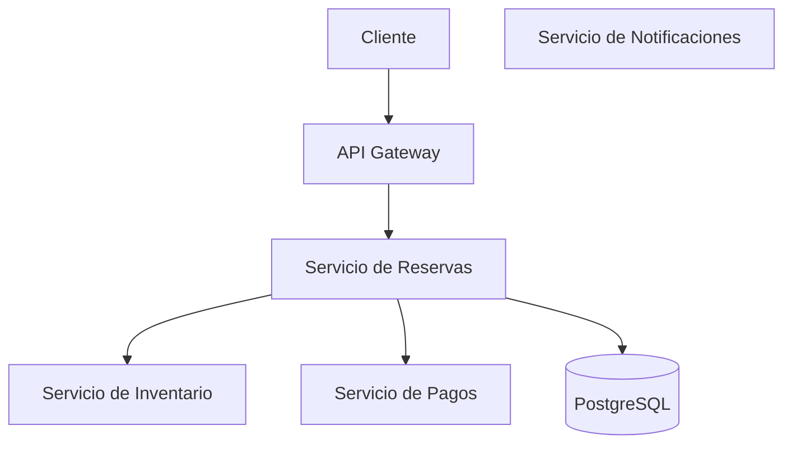

# Sistema de Reservas Resiliente

Sistema distribuido de reservas de entradas desarrollado para demostrar mecanismos de tolerancia a fallos en una arquitectura de microservicios.

El proyecto implementa patrones de resiliencia como **Circuit Breaker**, **reintentos con backoff exponencial**, **timeouts**, **fallback** y **Bulkhead**. También incluye manifiestos de Kubernetes y evidencias de pruebas controladas sobre un clúster multinodo.

## Integrantes

- David Villa Hernández
- Juan Fernando Álvarez Picón

Universidad Politécnica Salesiana — Computación, 2026.

## Objetivo

Diseñar, implementar y desplegar un sistema de reservas capaz de mantener un comportamiento controlado ante la caída, lentitud o saturación de sus servicios.

## Arquitectura



| Componente | Puerto | Responsabilidad |
| --- | ---: | --- |
| API Gateway | `8000` | Punto de entrada y límite de solicitudes concurrentes |
| Reservas | `8001` | Orquestación de inventario, pago y persistencia |
| Inventario | `8002` | Consulta y descuento de entradas |
| Pagos | `8003` | Simulación de pagos, latencia y fallos |
| Notificaciones | `8004` | Simulación del envío de notificaciones |
| PostgreSQL | `5432` | Persistencia de reservas |

> **Nota:** el servicio de Notificaciones está implementado y desplegado como servicio independiente, pero todavía no forma parte del flujo de creación de una reserva.

## Tecnologías

- Python 3.12
- FastAPI y Uvicorn
- PostgreSQL 17
- SQLAlchemy
- Docker y Docker Compose
- Kubernetes, `kubectl` y kind
- k6

## Estructura del proyecto

```text
.
├── docs/                  # Documentación complementaria
├── evidence/              # Resultados de las pruebas de resiliencia
├── kubernetes/
│   ├── base/              # Manifiestos de la aplicación
│   └── cluster/           # Configuración del clúster kind
├── scripts/
│   └── load/              # Prueba de carga con k6
├── services/
│   ├── api-gateway/
│   ├── database/
│   ├── inventario/
│   ├── notificaciones/
│   ├── pagos/
│   └── reservas/
├── docker-compose.yml
└── README.md
```

## Inicio rápido con Docker Compose

### Requisitos

- Docker Desktop con Docker Compose
- Git, si se va a clonar el repositorio

### 1. Clonar el repositorio

```bash
git clone https://github.com/Davidvillahdz/sistema-reservas-resiliente.git
cd sistema-reservas-resiliente
```

### 2. Construir e iniciar los servicios

```bash
docker compose up --build -d
```

### 3. Comprobar el estado

```bash
docker compose ps
```

La documentación interactiva del API Gateway queda disponible en:

- Swagger UI: <http://localhost:8000/docs>
- Estado del servicio: <http://localhost:8000/health>
- Estado del Bulkhead: <http://localhost:8000/bulkhead/status>

### 4. Crear una reserva

```bash
curl -X POST http://localhost:8000/reservations \
  -H "Content-Type: application/json" \
  -d '{
    "customer_name": "David Villa",
    "customer_email": "david@example.com",
    "event_id": 1,
    "quantity": 1
  }'
```

En PowerShell también se puede usar:

```powershell
$body = @{
    customer_name  = "David Villa"
    customer_email = "david@example.com"
    event_id       = 1
    quantity       = 1
} | ConvertTo-Json

Invoke-RestMethod `
    -Method Post `
    -Uri "http://localhost:8000/reservations" `
    -ContentType "application/json" `
    -Body $body
```

### 5. Detener el entorno

```bash
docker compose down
```

Para eliminar también el volumen de PostgreSQL:

```bash
docker compose down -v
```

## Kubernetes

El proyecto incluye una configuración kind de tres nodos —un nodo de control y dos trabajadores— en [`kubernetes/cluster/kind-config.yaml`](kubernetes/cluster/kind-config.yaml).

Los recursos de la aplicación están disponibles en [`kubernetes/base/`](kubernetes/base/). Incluyen Deployments, Services, sondas de salud, límites de recursos, afinidad de Pods, configuración de PostgreSQL y un volumen persistente.

> Los manifiestos de Kubernetes se conservan como parte de las pruebas realizadas. Antes de crear un entorno nuevo se deben revisar sus nombres de recursos y etiquetas de imágenes para que coincidan con las imágenes construidas localmente.

## Mecanismos de resiliencia

### 1. Recuperación ante la caída de un Pod

Kubernetes recrea automáticamente un Pod eliminado y mantiene las réplicas declaradas mediante un Deployment y su ReplicaSet.

**Mecanismos:** Deployment y ReplicaSet.

[Ver evidencia de la prueba](evidence/prueba-caida-pod-reservas.md)

### 2. Inventario Fantasma

Cuando Inventario deja de responder, Reservas evita llamadas indefinidas mediante un timeout, tres intentos con backoff exponencial y un Circuit Breaker.

El circuito se abre después de tres fallos y entra en recuperación después de 15 segundos.

**Mecanismos:** Circuit Breaker, timeout, reintentos y backoff exponencial.

[Ver evidencia de la prueba](evidence/prueba-inventario-fantasma.md)

### 3. Pasarela Lenta

Si Pagos supera el timeout de tres segundos, la reserva se persiste con el estado `payment_pending` para que la operación pueda continuar.

**Mecanismos:** timeout y fallback.

[Ver evidencia de la prueba](evidence/prueba-pasarela-lenta.md)

### 4. Diluvio de Peticiones

El API Gateway limita a cinco las solicitudes concurrentes por réplica. Cuando se alcanza ese límite, responde con `HTTP 429 Too Many Requests` y el encabezado `Retry-After`.

**Mecanismo:** Bulkhead.

[Ver evidencia de la prueba](evidence/prueba-diluvio-peticiones.md)

## Prueba de carga

La prueba de k6 utiliza 30 usuarios virtuales durante 20 segundos:

```bash
k6 run scripts/load/request-storm.js
```

El script está configurado para acceder a `http://localhost:8080`. Si el API Gateway se ejecuta mediante Docker Compose en el puerto `8000`, se debe actualizar temporalmente esa URL o establecer el reenvío de puertos correspondiente.

## Resultados

Las pruebas documentadas muestran que:

- Kubernetes recupera Pods eliminados y restablece el número de réplicas.
- El Circuit Breaker evita llamadas repetidas hacia Inventario durante una caída.
- El timeout y el fallback permiten persistir reservas cuando Pagos responde lentamente.
- El Bulkhead rechaza carga excedente de forma controlada con respuestas HTTP 429.
- PostgreSQL conserva las reservas creadas.

## Documentación adicional

- [Catálogo de fallos](docs/catalogo-fallos.md)
- [Distribución del trabajo](docs/distribucion-trabajo.md)
- [Evidencias de las pruebas](evidence/)

## Autores

**David Villa Hernández**

**Juan Fernando Álvarez Picón**

Universidad Politécnica Salesiana

Carrera de Computación — 2026
